 
## SEI 65 Project 2 Hackathon
 
## Crypto App

 

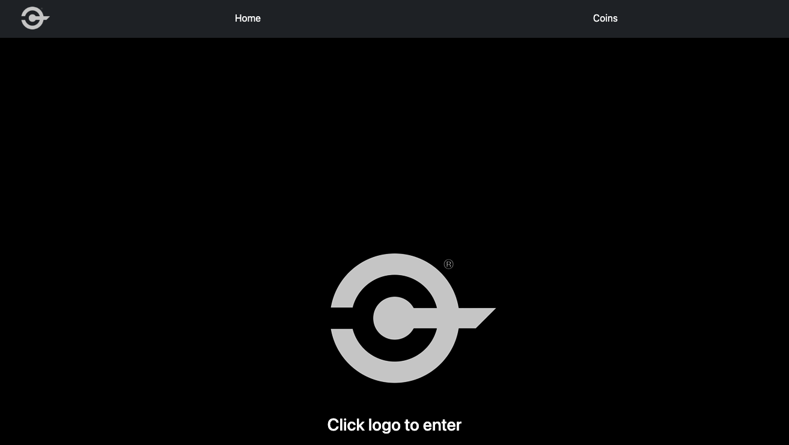

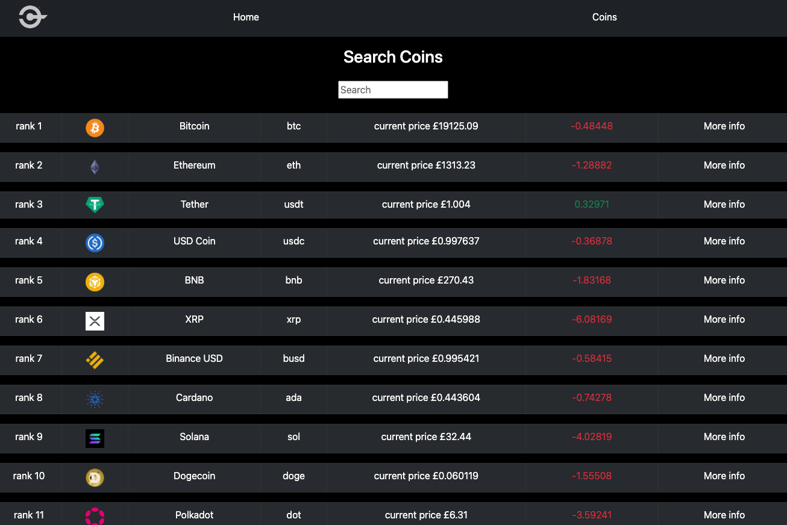

### Description
 
This second project took place at the end of week six, halfway through the course. The project was a mini-Hackathon using ReactJS and other packages to make an App.  We wanted to create an App that displays the main cryptocurrencies in a quick and easy to read format.  The data updates every 5 minutes.   
 
### Deployment Link
 
https://another-crypto-tracker.netlify.app
 
### Getting Started / Code Installation
 
GitHub repository for this project
 
https://github.com/markmuy40/SEI-65-Project-2
 
All the code is in the project-2.1 file.
 
### Timeframe & Working Team
 
This was a group project of 36 hours, split over two days. 
 
I worked with: 

Aaron Zahl
REPO: https://github.com/Zahlsky/SEI-65-Project-2
 
Charlie Hird 
REPO: https://github.com/cjhird/crypto-app

### Technologies Used
 
ReactJS: The main structure of the App for routing and components.
React Bootstrap: Layout for table and other visuals on the various pages.
NodeJS: Installing and running package dependencies used in this project.
SASS: Used for additional styling and layout.
HTML: Rendering the website in the browser.
JavaScript: Main language used in the project.
Google Chrome: Developer tools.
 
### Brief
 
The brief was to build a React Application that consumed a public API. The App needed a router, several pages and be deployed online. All groups would present their work and discuss their design, features, and learnings.
 
### Build / Code Process
 
We got together as a group the afternoon before and started looking at APIs for content we wanted to use, browsing various free APIs that had the content we required. I expressed that I didn’t mind too much on the subject but to find an API that could present well with depth of information and images / logos. Going for a Cryptocurrency API was a good fit. 
 
I set up a Google meeting after class and we got onto planning and wireframing our ideas. Learning from my previous experience, proper planning prevents poor performance. We pulled ideas together and drew them out in Excalidraw, adding in pseudocode.

 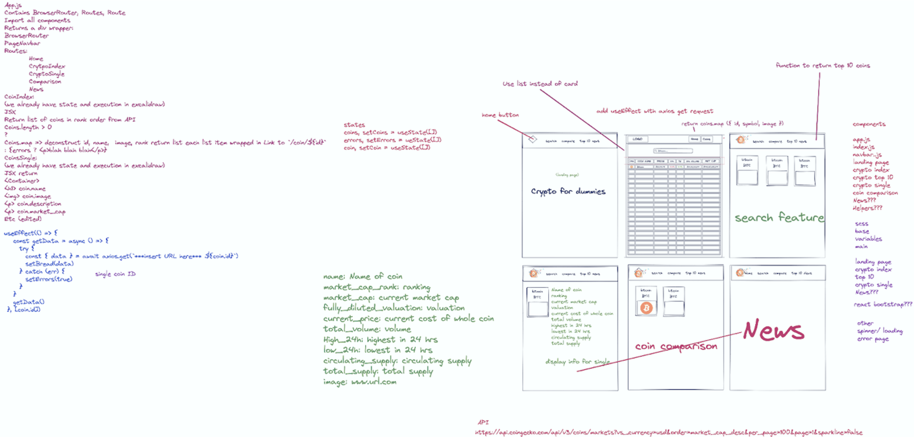
 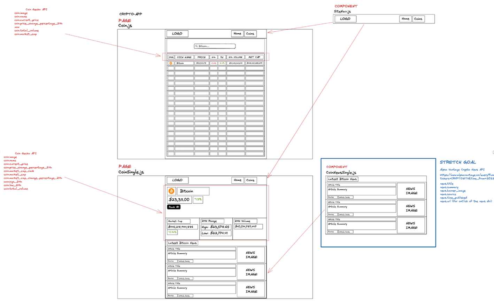
# image 5

 
As a collective we felt that a workflow would be important to the overall success of the project, especially with a small window of time. 
 
The fundamental pieces of having a Minimum Viable Product would be to complete and have working functions in the Coin Index and single coin pages. The stretch goal being to add in the news, then comparisons between cryptocurrencies.

Workflow plan:

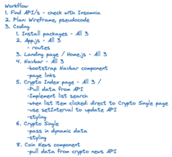

After wireframing in VSC, the first focus was to create the index page and display data, so we could be ready to present.
 
At this point we could break out and work on separate components individually.

We were given a format to use which gave us the basic boilerplate to build on.

To save on merge conflicts in git, we decided to use VSC live share, run off my machine. I shared my screen, ran the command ‘npx create-react-app project-2’ and got to work building the app. I created the various components; CoinIndex.js and CoinSingle.js to start, setting up the return functions as I went along, dropping in a h1 tag saying what each component was. This would be vital at this early stage for checking routing. Charlie set up routes in App.js. We verified these all worked. We also added in the various SASS files ensuring they were imported back to main.
 
Next part was pulling the data from the API. Using a previously used React Bootstrap card format we could ensure the API worked and was feeding in the data.

Axios get request:

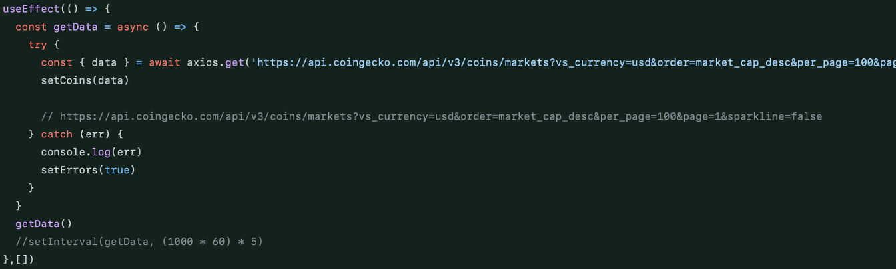

Original setup using bootstrap cards:
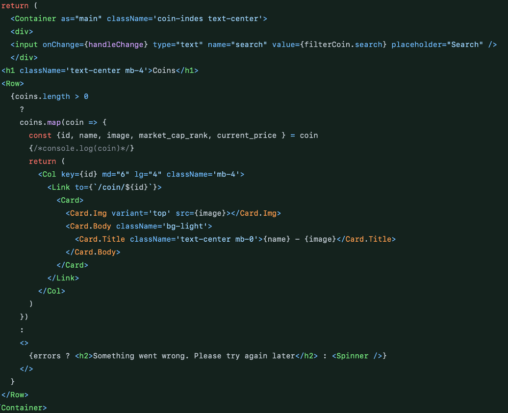
 
 
Once this was all working, we worked on our individual pieces.
 
My main goals were to set up the search function and display the information using a table format as that is more useful for an end user. The card format took up a lot of space for such little info. From previous learnings, I used the documentation for a React bootstrap table and imported it to the CoinIndex.js page before setting to work reformatting.
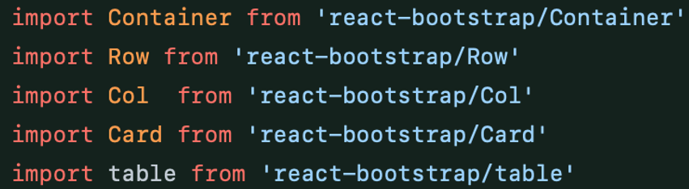
 
 Reformatting JSX:
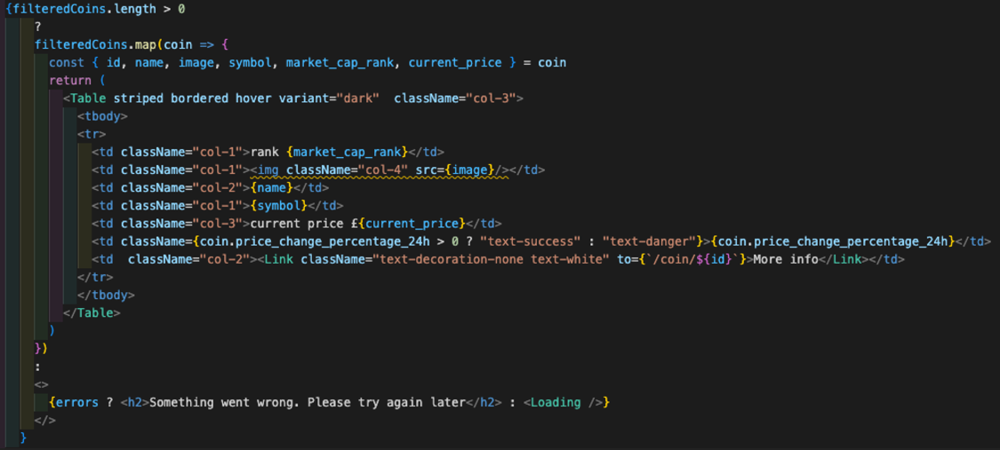
 
The reformatting worked exactly as expected:
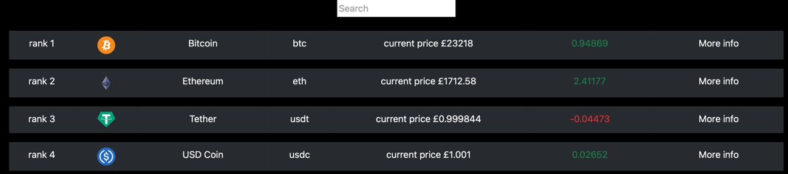
 
Setting up the search feature took longer than expected. With some borrowed code from a previous project, and using a series of console logs, I got the expected result from the handleChange function.
 
The search input in JSX:
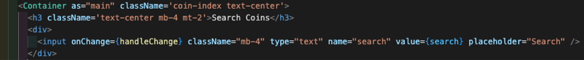
 
The useState and handleChange:
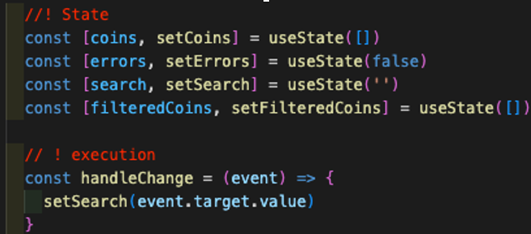
 
 
With this returning the expected value (verified with a colsole.log(‘value’, value)), I tried to make it test against the coins array using regex from a piece of work previously produced. It took a long time to make it work, realising I didn’t understand enough to refactor to the intended purpose. After getting some additional help, the logic was clarified; a lesson learned.

useEffect to track the change and set to filtered array:
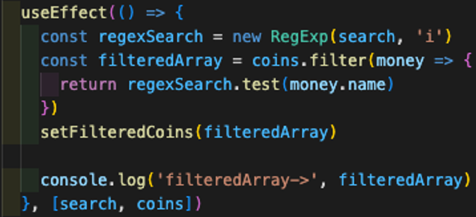

 
 
The search works in real time as you type:
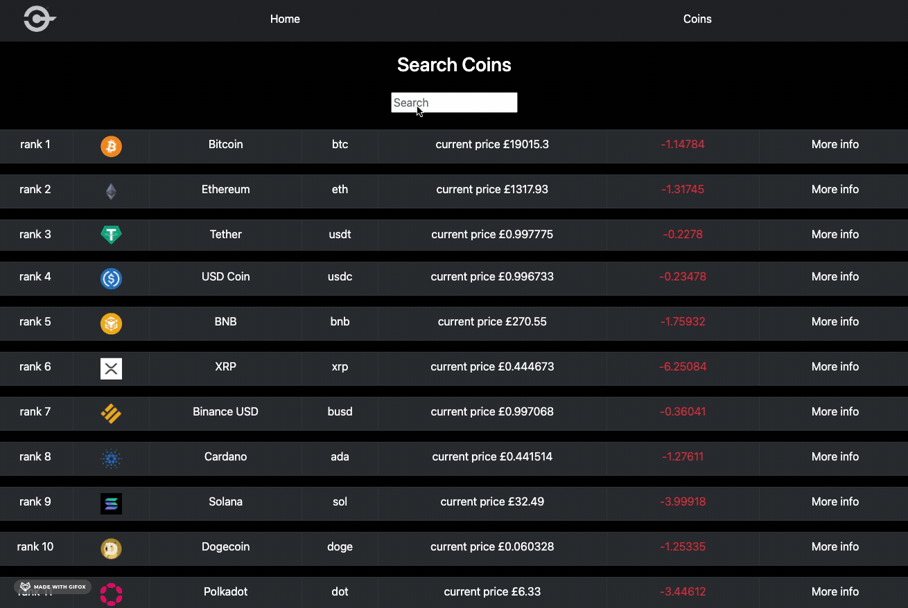
 

Remaining project time was ending, so I called everyone in to get an idea of where we were at in the project; main page done, SingleCoin page completed. Charlie managed to sort one of the stretch goals and implemented it into the project, with Aaron and I helping with styling. I moved on to make a landing page to give a more complete presentation. This meant checking and renaming routes and end points. Also, keeping in theme to add in the Logo and making it a clickable link, the same with the logo in the top left.  
 
We were keen to use a spinner and there was only a header in there that we used to check routes at the start. I know React Bootstrap has a variety that can be stylised to our needs. Adding in code and being able to visualise it really helped get it where I wanted it. Once happy, I commented in the getData() function. 
 
Spinner code with import:
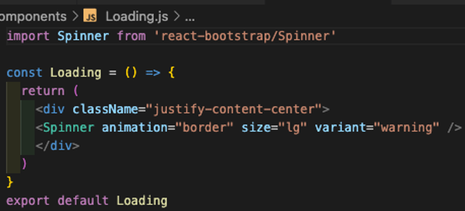
 
I wanted to check all routes and commented out a piece of code so I could see what our Loading page looked like as the data wouldn’t be stored.  I commented out the getData() function callback.

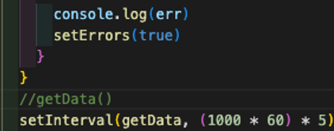

 
Spinner in action:
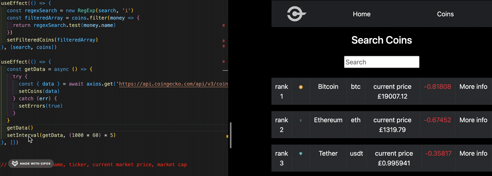
 
 
We checked routes and we had one final gathering before the presentation, checked the news input that Charlie worked on was feeding in correctly and that we had a fully working app.
 
As I had the VSCode already running, and the App fully working on my machine, I was elected to present with the team jumping in as needed. I presented, showing all routes, thought process, reason for choosing the API and taking in questions.  
 
### Challenges
 
Working as a pair can be tricky enough with a small timeframe and using one VSCode to save on Git merging conflicts. Adding in a third person adds to the potential for issues. Through good clear communication and organising ourselves, we never experienced any major problems. Also, the advantage of having another person to help with problem solving and working through logical solutions was an advantage for us. My previous career as a Store Manager helped to organise our group, being supportive and nurturing ideas, as well as being able to fulfil my workload.
 
 
**Learn continually – there’s always “one more thing” to learn! - Steve Jobs**
 
Borrowing code that I previously used and couldn’t get to work for this project was frustrating. I knew it worked in a previous context, so why not here? It showed an area that I didn’t know enough about. I went back to fundamentals and got to a place where I couldn’t get any further, before asking for help. As a collective we couldn’t solve it, so asked for assistance from our tutor, who explained what we had done, where it wasn’t working, and helped us to understand for future use. In hindsight, I could ask for help sooner, but I wanted to work through and get as far as I could. Would I do anything different? Maybe research and understand more, really exhausting resources. 
 
 
### Wins
 
The biggest win is that we have a fully working App with all the functions working. I’m proud of what our group produced in a small time frame, with everyone working in the right direction. 
 
Almost all styling was done through React Bootstrap. As it can be rigid and restrictive, it was a real eye opener to see that our app was very React Bootstrap heavy, with little SASS.  For an app like this, it was an ideal choice, and a quicker way of displaying information. It gave me a better understanding of best use cases for both, and they can work in tandem when required.
 
We all helped with each other when required and worked as a collective, even offering each other support to show solidarity. Teamwork can be a hindrance on a project, but in this case, having the understanding that everyone works in different ways allowed us to get on with the project at hand.
 
### Key Learnings / Takeaways
 
A real positive I can take away from this project is my ability to understand and implement React Bootstrap components I haven’t used before. As much as I enjoy using SASS and styling in general, being able to understand the React Bootstrap documentation, absorb and implement it so it works as expected is a big win.
 
Being able to implement what we learned from the beginning of module 2 (props, hooks, useState, useEffect, ReactJS, using APIs) was a great experience. It was very content heavy and being able to practice it in a group helped with the learning process. I have gained confidence in these areas and look forward to building on what I have learnt so far.
 
Going first and presenting our work was a positive experience. I enjoyed showing our work and felt confident that it was a complete product. I didn’t have to worry about any issues. I have grown in confidence throughout this course. Using previous experiences as a leader enabled me to be decisive when necessary and keep the project on track.
 

### Bugs
 
The deployed product is fully working, but there is a syntax warning and a warning regarding unique keys not being used in the IndexNews component. They don’t affect the app's functionality at present.
 
Doge coin isn’t displaying the information when clicked. I think this is to do with the return of the API data not being in the same format.
 
### Future Improvements
 
· 	Fix the above bugs.
· 	Reformat the SingleCoin page, coin logo on the left, info to the right. It will bring the news up the page and improve the UI.
· 	Improve the way the news is displayed. Perhaps preview the image on our page, with the page displaying in full on another component, with a route back. 
· 	Still a lot of console logs left open. I would remove them for posterity.
· 	Create a logo of our own.  

